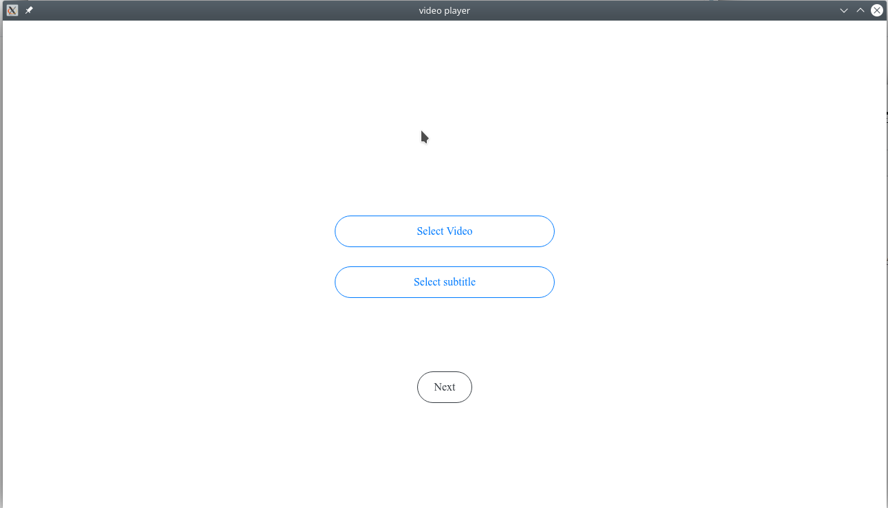
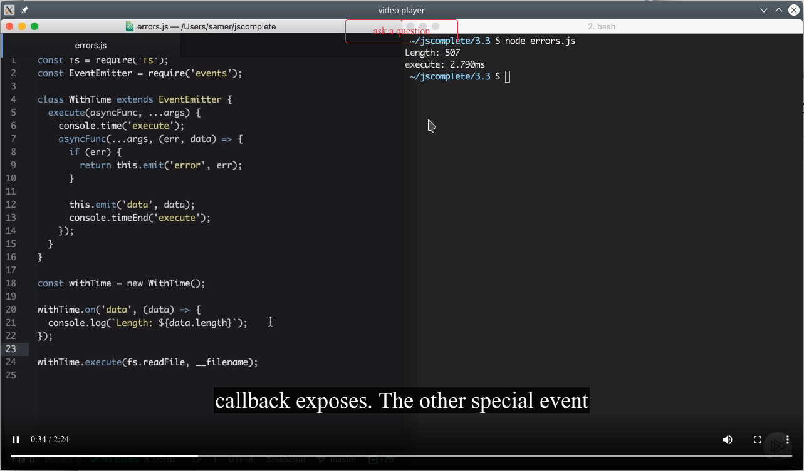
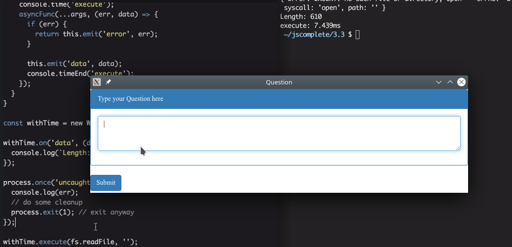
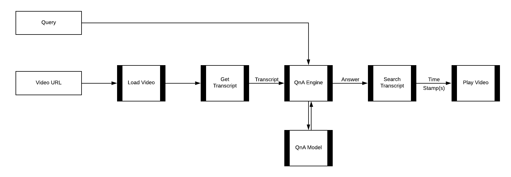

# Ask-Vids

This project aims to utilize cutting-edge machine comprehension algorithms for running queries on videos. 

## Steps to Run 
1. Install the dependencies:
    - `$ npm install` 
2. Run the application: 
    - `$ npm start` 

## Some Screen-shots

## How it all Works 
